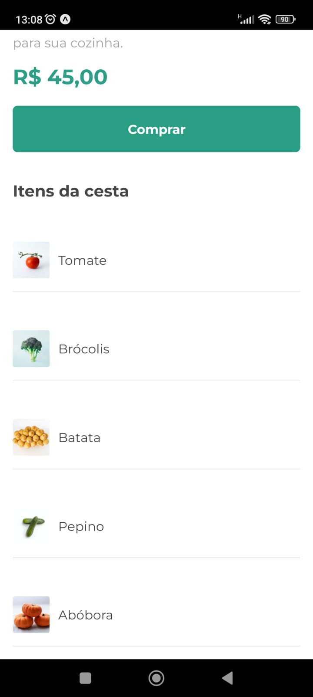

# React Native - APP

Criamos um projeto React Native utilizando Expo e também entendemos um pouco sobre as diferenças entre utilizar o Expo CLI e o React Native CLI.

- Preparar o ambiente
    - Instalamos o Node.js e o Expo para poder desenvolver aplicativos React Native com Expo.
- Diferenças entre React Native CLI e Expo CLI
    - Entendemos que o Expo CLI cria uma aplicação React Native com limitações, em contrapartida podemos testar nossas aplicações sem configurar Android Studio ou Xcode.
- Criar um aplicativo Expo do zero
    - Utilizamos o Expo CLI para criar um projeto React Native em branco.
- Função live reload
    - O React Native vem por padrão com a funcionalidade de live reload, que atualiza a tela do app ao salvar novos códigos em tempo real.
- Utilizar componentes:
    - Aprendemos a utilizar componentes próprios do react native como `Text` e `View`, componentes de bibliotecas e também nossos próprios componentes.
- Criar componentes:
    - Utilizando funções, criamos nosso primeiro componente: a Cesta.
- Estilizar componentes:
    - A fim de sermos mais fiéis ao layout, usamos estilos para mudar fontes, tamanhos, alinhamentos, espaçamentos e cores.
- Fonte externa:
    - Usando uma biblioteca do expo, adicionamos uma fonte externa do Google Fontes e aplicamos um texto na nossa aplicação.
- Reutilizar componentes:
    - Aprendemos a criar um componente reutilizável que encapsula a lógica de trocar a fonte do texto automaticamente.
- Usar parâmetros:
    - Aprendemos a passar e resgatar parâmetros nos componentes.
- Desconstruir objetos:
    - Conseguimos remover a camada externa dos objetos para que possamos passar cada parâmetro do objeto como um parâmetro do componente, simplificando a declaração desses parâmetros.
- Estender o tempo da splash screen:
    - Usando a biblioteca do Expo para chamar o AppLoading, podemos fazer a splash screen ser exibida por mais tempo enquanto as funções do nosso app são carregadas antes de exibir o conteúdo de fato.
- Button:
    - Aprendemos a usar o Button, que é um botão simples e com pouca customização.
- Botão Customizado:
    - Com os componentes TouchableOpacity, TouchableWithoutFeesback, criamos botões muito mais customizados.
- ScrollView:
    - Aprendemos a usar a ScrollView para permitir rolagem na tela, desde que não usando FlatList, pois há incompatibilidades entre esses dois componentes.
- FlatList:
    - Aprendemos a otimizar listas e fazer a rolagem da tela exclusivamente com o FlatList.